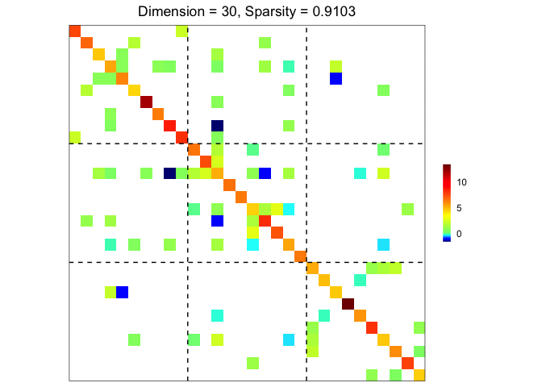
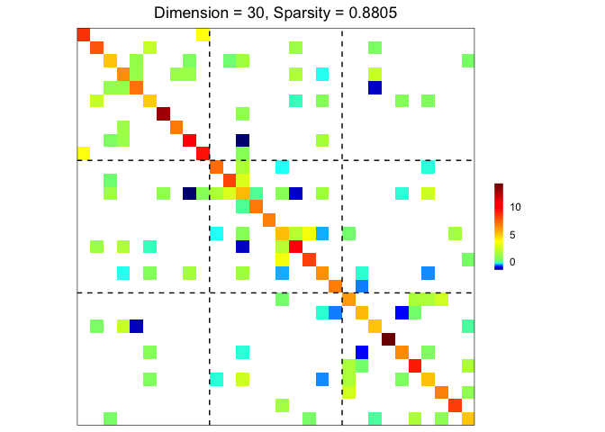
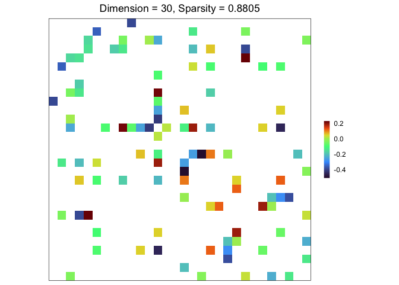

<!-- README.md is generated from README.Rmd. Please edit that file -->

# grasps 

## Groupwise Regularized Adaptive Sparse Precision Solution

[](https://CRAN.R-project.org/package=grasps)
[](https://github.com/Carol-seven/grasps/blob/main/DESCRIPTION)
[](https://github.com/Carol-seven/grasps/commits/main)
[](https://github.com/Carol-seven/grasps/actions/workflows/R-CMD-check.yaml)
[](https://github.com/Carol-seven/grasps/blob/main/LICENSE.md)

The goal of **grasps** is to provide a collection of statistical methods that
incorporate both element-wise and group-wise penalties to estimate a precision
matrix, making them user-friendly and useful for researchers and practitioners.

$$
\hat{\Omega}(\lambda,\alpha,\gamma) = {\arg\min}_{\Omega \succ 0}
\left\{ -\log\det(\Omega) + \text{tr}(S\Omega) + \mathcal{P}_{\lambda,\alpha,\gamma}(\Omega) \right\},
$$
$$
\mathcal{P}_{\lambda,\alpha,\gamma}(\Omega)
= \alpha \mathcal{P}^\text{idv}_{\lambda,\gamma}(\Omega) + (1-\alpha) \mathcal{P}^\text{grp}_{\lambda,\gamma}(\Omega),
$$
$$
\mathcal{P}^\text{idv}_{\lambda,\gamma}(\Omega)
= \sum_{i,j} P_{\lambda,\gamma}(\lvert\omega_{ij}\rvert),
$$
$$
\mathcal{P}^\text{grp}_{\lambda,\gamma}(\Omega)
= \sum_{g,g^\prime} P_{\lambda,\gamma}(\lVert\Omega_{gg^\prime}\rVert_F).
$$

For more details, see the vignette
[Penalized Precision Matrix Estimation in grasps](https://shiying-xiao.com/grasps/articles/pen_est#sparse-group-estimator).


## Penalties

The package **grasps** provides functions to estimate precision matrices using
the following penalties:

| Penalty | Reference |
|:---|:---|
| Lasso (`penalty = "lasso"`) | Tibshirani ([1996](#ref-tibshirani1996regression)); Friedman et al. ([2008](#ref-friedman2008sparse)) |
| Adaptive lasso (`penalty = "adapt"`) | Zou ([2006](#ref-zou2006adaptive)); Fan et al. ([2009](#ref-fan2009network)) |
| Atan (`penalty = "atan"`) | Wang and Zhu ([2016](#ref-wang2016variable)) |
| Exp (`penalty = "exp"`) | Wang et al. ([2018](#ref-wang2018variable)) |
| Lq (`penalty = "lq"`) | Frank and Friedman ([1993](#ref-frank1993statistical)); Fu ([1998](#ref-fu1998penalized)); Fan and Li ([2001](#ref-fan2001variable)) |
| LSP (`penalty = "lsp"`) | Candès et al. ([2008](#ref-candes2008enhancing)) |
| MCP (`penalty = "mcp"`) | Zhang ([2010](#ref-zhang2010nearly)) |
| SCAD (`penalty = "scad"`) | Fan and Li ([2001](#ref-fan2001variable)); Fan et al. ([2009](#ref-fan2009network)) |

See the vignette
[Penalized Precision Matrix Estimation in grasps](https://shiying-xiao.com/grasps/articles/pen_est#penalties)
for more details.

## Installation

- You can install the released version of **grasps** from
  [CRAN](https://cran.r-project.org/package=grasps) with:

<!-- -->

    install.packages("grasps")

- You can install the development version of **grasps** from
  [GitHub](https://github.com/Carol-seven/grasps) with:

<!-- -->

    # install.packages("devtools")
    devtools::install_github("Carol-seven/grasps")

## Example

``` r
library(grasps)

## reproducibility for everything
set.seed(1234)

## block-structured precision matrix based on SBM
sim <- gen_prec_sbm(p = 30, K = 3,
                    within.prob = 0.25, between.prob = 0.05,
                    weight.dists = list("gamma", "unif"),
                    weight.paras = list(c(shape = 20, rate = 10),
                                        c(min = 0, max = 5)),
                    cond.target = 100)
## ground truth visualization
plot(sim)
```



``` r

## n-by-p data matrix
library(MASS)
X <- mvrnorm(n = 20, mu = rep(0, 30), Sigma = sim$Sigma)

## precision matrix: adaptive lasso; BIC
prec <- grasps(X = X, membership = sim$membership, penalty = "adapt", crit = "BIC")

## precision matrix visualization
plot(prec)
```



``` r

## performance
performance(hatOmega = prec$hatOmega, Omega = sim$Omega)
#>      measure    value
#> 1   sparsity   0.8805
#> 2  Frobenius  23.9013
#> 3         KL   7.6775
#> 4  quadratic  69.1639
#> 5   spectral  12.3571
#> 6         TP  23.0000
#> 7         TN 358.0000
#> 8         FP  29.0000
#> 9         FN  25.0000
#> 10       TPR   0.4792
#> 11       FPR   0.0749
#> 12        F1   0.4600
#> 13       MCC   0.3904

## adjacency matrix: diagonal = 0; raw partial correlations;
##                   no thresholding; weighted network
adj <- prec_to_adj(prec$hatOmega,
                   diag.zero = TRUE, absolute = FALSE,
                   threshold = NULL, weighted = TRUE)

## adjacency matrix visualization
plot(adj)
```



## Reference

<div id="refs" class="references csl-bib-body hanging-indent">

<div id="ref-candes2008enhancing" class="csl-entry">

Candès, Emmanuel J., Michael B. Wakin, and Stephen P. Boyd. 2008. “Enhancing Sparsity by Reweighted $\ell_1$ Minimization.” *Journal of Fourier Analysis and Applications* 14 (5): 877–905. <https://doi.org/10.1007/s00041-008-9045-x>.

</div>

<div id="ref-fan2009network" class="csl-entry">

Fan, Jianqing, Yang Feng, and Yichao Wu. 2009. “Network Exploration via the Adaptive LASSO and SCAD Penalties.” *The Annals of Applied Statistics* 3 (2): 521–41. <https://doi.org/10.1214/08-aoas215>.

</div>

<div id="ref-fan2001variable" class="csl-entry">

Fan, Jianqing, and Runze Li. 2001. “Variable Selection via Nonconcave Penalized Likelihood and Its Oracle Properties.” *Journal of the American Statistical Association* 96 (456): 1348–60. <https://doi.org/10.1198/016214501753382273>.

</div>

<div id="ref-frank1993statistical" class="csl-entry">

Frank, Lldiko E., and Jerome H. Friedman. 1993. “A Statistical View of Some Chemometrics Regression Tools.” *Technometrics* 35 (2): 109–35. <https://doi.org/10.1080/00401706.1993.10485033>.

</div>

<div id="ref-friedman2008sparse" class="csl-entry">

Friedman, Jerome, Trevor Hastie, and Robert Tibshirani. 2008. “Sparse Inverse Covariance Estimation with the Graphical Lasso.” *Biostatistics* 9 (3): 432–41. <https://doi.org/10.1093/biostatistics/kxm045>.

</div>

<div id="ref-fu1998penalized" class="csl-entry">

Fu, Wenjiang J. 1998. “Penalized Regressions: The Bridge Versus the Lasso.” *Journal of Computational and Graphical Statistics* 7 (3): 397–416. <https://doi.org/10.1080/10618600.1998.10474784>.

</div>

<div id="ref-tibshirani1996regression" class="csl-entry">

Tibshirani, Robert. 1996. “Regression Shrinkage and Selection via the Lasso.” *Journal of the Royal Statistical Society: Series B (Methodological)* 58 (1): 267–88. <https://doi.org/10.1111/j.2517-6161.1996.tb02080.x>.

</div>

<div id="ref-wang2018variable" class="csl-entry">

Wang, Yanxin, Qibin Fan, and Li Zhu. 2018. “Variable Selection and Estimation Using a Continuous Approximation to the $L_0$ Penalty.” *Annals of the Institute of Statistical Mathematics* 70 (1): 191–214. <https://doi.org/10.1007/s10463-016-0588-3>.

</div>

<div id="ref-wang2016variable" class="csl-entry">

Wang, Yanxin, and Li Zhu. 2016. “Variable Selection and Parameter Estimation with the Atan Regularization Method.” *Journal of Probability and Statistics* 2016: 6495417. <https://doi.org/10.1155/2016/6495417>.

</div>

<div id="ref-zhang2010nearly" class="csl-entry">

Zhang, Cun-Hui. 2010. “Nearly Unbiased Variable Selection Under Minimax Concave Penalty.” *The Annals of Statistics* 38 (2): 894–942. <https://doi.org/10.1214/09-AOS729>.

</div>

<div id="ref-zou2006adaptive" class="csl-entry">

Zou, Hui. 2006. “The Adaptive Lasso and Its Oracle Properties.” *Journal of the American Statistical Association* 101 (476): 1418–29. <https://doi.org/10.1198/016214506000000735>.

</div>

</div>
