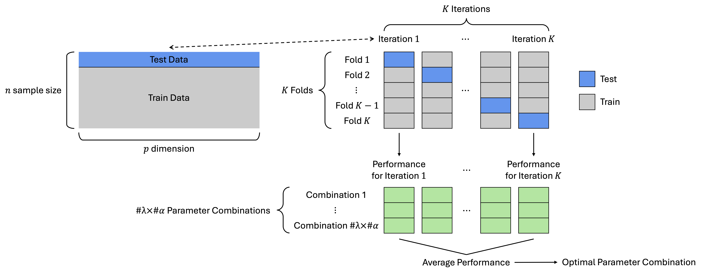

# Selection Criteria for Parameters in grasps

## Introduction

Precision matrix estimation requires selecting appropriate
regularization parameter \\\lambda\\ to balance sparsity (number of
edges) and model fit (likelihood), and a mixing parameter \\\alpha\\ to
trade off between element-wise (individual-level) and block-wise
(group-level) penalties.

## Background: Negative Log-Likelihood

In a Gaussian graphical model (GGM), the data matrix \\X\_{n \times d}\\
consists of \\n\\ independent and identically distributed observations
\\X_1, \dots, X_n\\ drawn from \\N_d(\mu,\Sigma)\\. Let \\\Omega =
\Sigma^{-1}\\ denote the precision matrix, and define the empirical
covariance matrix as \\S = n^{-1} \sum\_{i=1}^n
(X_i-\bar{X})(X_i-\bar{X})^\top\\. Up to an additive constant, the
negative log-likelihood (nll) for \\\Omega\\ simplified to \\
\mathrm{nll}(\Omega) = \frac{n}{2}\[-\log\det(\Omega) +
\mathrm{tr}(S\Omega)\]. \\ The edge set \\E(\Omega)\\ is determined by
the non-zero off-diagonal entries: an edge \\(i, j)\\ is included if and
only if \\\omega\_{ij} \neq 0\\ for \\i \< j\\. The number of edges is
therefore given by \\\vert E(\Omega) \vert\\.

## Selection Criteria

1.  AIC: Akaike information criterion ([Akaike
    1973](#ref-akaike1973information))

\\ \hat{\Omega}\_{\mathrm{AIC}} = {\arg\min}\_{\Omega} \left\\
2\\\mathrm{nll}(\Omega) + 2\\\lvert E(\Omega) \rvert \right\\. \\

2.  BIC: Bayesian information criterion ([Schwarz
    1978](#ref-schwarz1978estimating))

\\ \hat{\Omega}\_{\mathrm{BIC}} = {\arg\min}\_{\Omega} \left\\
2\\\mathrm{nll}(\Omega) + \log(n)\\\lvert E(\Omega) \rvert \right\\. \\

3.  EBIC: Extended Bayesian information criterion ([Chen and Chen
    2008](#ref-chen2008extended); [Foygel and Drton
    2010](#ref-foygel2010extended))

\\ \hat{\Omega}\_{\mathrm{EBIC}} = {\arg\min}\_{\Omega} \left\\
2\\\mathrm{nll}(\Omega) + \log(n)\\\lvert E(\Omega) \rvert +
4\\\xi\\\log(d)\\\lvert E(\Omega) \rvert \right\\, \\

where \\\xi \in \[0,1\]\\ is a tuning parameter. Setting \\\xi = 0\\
reduces EBIC to the classic BIC.

4.  HBIC: High dimensional Bayesian information criterion ([Wang, Kim,
    and Li 2013](#ref-wang2013calibrating); [Fan et al.
    2017](#ref-fan2017high))

\\ \hat{\Omega}\_{\mathrm{HBIC}} = {\arg\min}\_{\Omega} \left\\
2\\\mathrm{nll}(\Omega) + \log\[\log(n)\]\\\log(d)\\\lvert E(\Omega)
\rvert \right\\. \\

5.  \\k\\-fold cross validation with negative log-likelihood loss.

Figure 1: \\K\\-fold cross-validation procedure for tuning (\\\lambda\\,
\\\alpha\\) using negative log-likelihood loss.

## Reference

Akaike, Hirotogu. 1973. “Information Theory and an Extension of the
Maximum Likelihood Principle.” In *Second International Symposium on
Information Theory*, edited by Boris Nikolaevich Petrov and Frigyes
Csáki, 267–81. Budapest, Hungary: Akadémiai Kiadó.

Chen, Jiahua, and Zehua Chen. 2008. “Extended Bayesian Information
Criteria for Model Selection with Large Model Spaces.” *Biometrika* 95
(3): 759–71. <https://doi.org/10.1093/biomet/asn034>.

Fan, Jianqing, Han Liu, Yang Ning, and Hui Zou. 2017. “High Dimensional
Semiparametric Latent Graphical Model for Mixed Data.” *Journal of the
Royal Statistical Society Series B: Statistical Methodology* 79 (2):
405–21. <https://doi.org/10.1111/rssb.12168>.

Foygel, Rina, and Mathias Drton. 2010. “Extended Bayesian Information
Criteria for Gaussian Graphical Models.” In *Advances in Neural
Information Processing Systems 23 (NIPS 2010)*, edited by J. Lafferty,
C. Williams, J. Shawe-Taylor, R. Zemel, and A. Culotta, 604–12. Red
Hook, NY, USA: Curran Associates, Inc.

Schwarz, Gideon. 1978. “Estimating the Dimension of a Model.” *The
Annals of Statistics* 6 (2): 461–64.
<https://doi.org/10.1214/aos/1176344136>.

Wang, Lan, Yongdai Kim, and Runze Li. 2013. “Calibrating Nonconvex
Penalized Regression in Ultra-High Dimension.” *The Annals of
Statistics* 41 (5): 2505–36. <https://doi.org/10.1214/13-AOS1159>.
