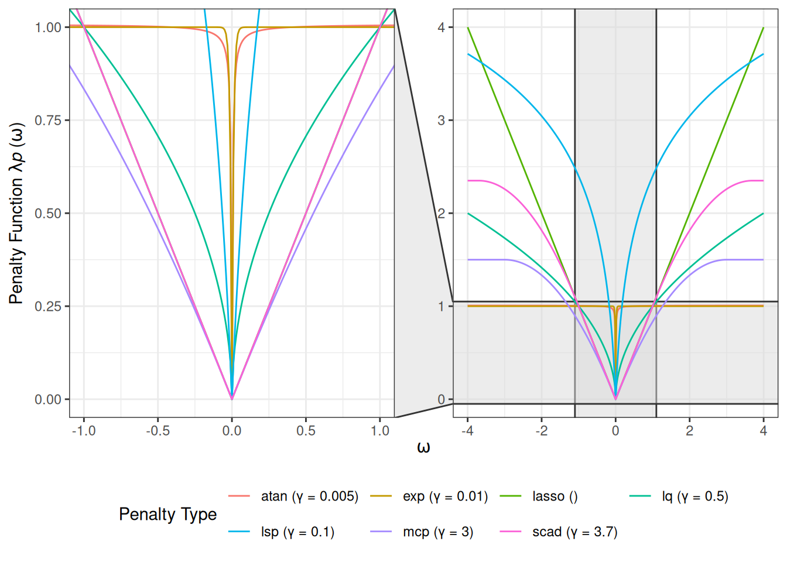
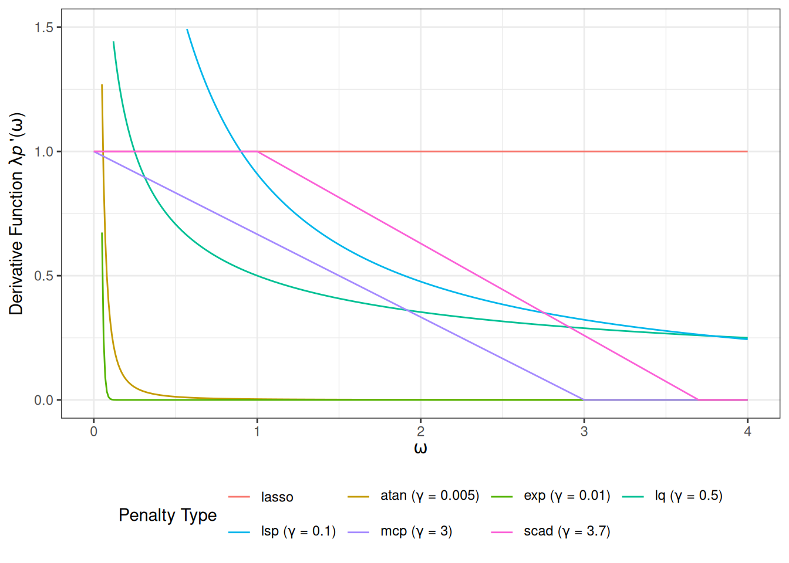

# Penalized Precision Matrix Estimation in grasps

## Preliminary

Consider the following setting:

- **Gaussian graphical model (GGM) assumption:**  
  The data \\X\_{n \times d}\\ consists of independent and identically
  distributed samples \\X_1, \dots, X_n \sim N_d(\mu,\Sigma)\\.

- **Disjoint group structure:**  
  The \\d\\ variables can be partitioned into disjoint groups.

- **Goal:**  
  Estimate the precision matrix \\\Omega = \Sigma^{-1} =
  (\omega\_{ij})\_{d \times d}\\.

## Sparse-Group Estimator

\\\begin{gather} \hat{\Omega}(\lambda,\alpha,\gamma) =
{\arg\min}\_{\Omega \succ 0} \left\\ -\log\det(\Omega) +
\text{tr}(S\Omega) + \lambda P\_{\alpha,\gamma}(\Omega) \right\\,
\\\[10pt\] P\_{\alpha,\gamma}(\Omega) = \alpha
P^\text{idv}\_\gamma(\Omega) + (1-\alpha) P^\text{grp}\_\gamma(\Omega),
\\\[10pt\] P^\text{idv}\_\gamma(\Omega) = \sum\_{i,j}
p\_\gamma(\vert\omega\_{ij}\vert), \\\[5pt\]
P^\text{grp}\_\gamma(\Omega) = \sum\_{g,g^\prime}
p\_\gamma(\Vert\Omega\_{gg^\prime}\Vert_F). \end{gather}\\

where:

- \\S = n^{-1} \sum\_{i=1}^n (X_i-\bar{X})(X_i-\bar{X})^\top\\ is the
  empirical covariance matrix.

- \\\lambda \geq 0\\ is the global regularization parameter controlling
  overall shrinkage.

- \\\alpha \in \[0,1\]\\ is the mixing parameter controlling the balance
  between element-wise and block-wise penalties.

- \\\gamma\\ is the additional parameter controlling the curvature and
  effective degree of nonconvexity of the penalty.

- \\P\_{\alpha,\gamma}(\Omega)\\ is a generic bi-level penalty template
  that can incorporate convex or non-convex regularizers while
  preserving the intrinsic group structure among variables.

- \\P^\text{idv}\_\gamma(\Omega)\\ is the element-wise individual
  penalty component.

- \\P^\text{grp}\_\gamma(\Omega)\\ is the block-wise group penalty
  component.

- \\p\_\gamma(\cdot)\\ is a penalty kernel parameterized by \\\gamma\\.

- \\\Omega\_{gg^\prime}\\ is the submatrix of \\\Omega\\ with the rows
  from group \\g\\ and columns from group \\g^\prime\\.

- The Frobenius norm \\\Vert\Omega\Vert_F\\ is defined as
  \\\Vert\Omega\Vert_F = (\sum\_{i,j} \vert\omega\_{ij}\vert^2)^{1/2} =
  \[\text{tr}(\Omega^\top\Omega)\]^{1/2}\\.

**Note**:

- The regularization parameter \\\lambda\\ acts as the scale factor for
  the entire penalty term \\\lambda P\_{\alpha,\gamma}(\Omega)\\.

- The penalty kernel \\p\_\gamma(\cdot)\\ is the shape function that
  governs the fundamental characteristics of the regularization.

## Penalties

1.  Lasso: Least absolute shrinkage and selection operator ([Tibshirani
    1996](#ref-tibshirani1996regression); [Friedman, Hastie, and
    Tibshirani 2008](#ref-friedman2008sparse))

\\\lambda p(\omega\_{ij}) = \lambda\vert\omega\_{ij}\vert.\\

2.  Adaptive lasso ([Zou 2006](#ref-zou2006adaptive); [Fan, Feng, and Wu
    2009](#ref-fan2009network))

\\ \lambda p\_\gamma(\omega\_{ij}) =
\lambda\frac{\vert\omega\_{ij}\vert}{v\_{ij}}, \\ where \\V =
(v\_{ij})\_{d \times d} = (\vert\tilde{\omega}\_{ij}\vert^\gamma)\_{d
\times d}\\ is a matrix of adaptive weights, and
\\\tilde{\omega}\_{ij}\\ is the initial estimate obtained using
`penalty = "lasso"`.

3.  Atan: Arctangent type penalty ([Wang and Zhu
    2016](#ref-wang2016variable))

\\ \lambda p\_\gamma(\omega\_{ij}) = \lambda(\gamma+\frac{2}{\pi})
\arctan\left(\frac{\vert\omega\_{ij}\vert}{\gamma}\right), \quad \gamma
\> 0. \\

4.  Exp: Exponential type penalty ([Wang, Fan, and Zhu
    2018](#ref-wang2018variable))

\\ \lambda p\_\gamma(\omega\_{ij}) =
\lambda\left\[1-\exp\left(-\frac{\vert\omega\_{ij}\vert}{\gamma}\right)\right\],
\quad \gamma \> 0. \\

5.  Lq ([Frank and Friedman 1993](#ref-frank1993statistical); [Fu
    1998](#ref-fu1998penalized); [Fan and Li
    2001](#ref-fan2001variable))

\\ \lambda p\_\gamma(\omega\_{ij}) =
\lambda\vert\omega\_{ij}\vert^\gamma, \quad 0 \< \gamma \< 1. \\

6.  LSP: Log-sum penalty ([Candès, Wakin, and Boyd
    2008](#ref-candes2008enhancing))

\\ \lambda p\_\gamma(\omega\_{ij}) =
\lambda\log\left(1+\frac{\vert\omega\_{ij}\vert}{\gamma}\right), \quad
\gamma \> 0. \\

7.  MCP: Minimax concave penalty ([Zhang 2010](#ref-zhang2010nearly))

\\ \lambda p\_\gamma(\omega\_{ij}) = \begin{cases}
\lambda\vert\omega\_{ij}\vert - \dfrac{\omega\_{ij}^2}{2\gamma}, &
\text{if } \vert\omega\_{ij}\vert \leq \gamma\lambda, \\
\dfrac{1}{2}\gamma\lambda^2, & \text{if } \vert\omega\_{ij}\vert \>
\gamma\lambda. \end{cases} \quad \gamma \> 1. \\

8.  SCAD: Smoothly clipped absolute deviation ([Fan and Li
    2001](#ref-fan2001variable); [Fan, Feng, and Wu
    2009](#ref-fan2009network))

\\ \lambda p\_\gamma(\omega\_{ij}) = \begin{cases}
\lambda\vert\omega\_{ij}\vert & \text{if } \vert\omega\_{ij}\vert \leq
\lambda, \\
\dfrac{2\gamma\lambda\vert\omega\_{ij}\vert-\omega\_{ij}^2-\lambda^2}{2(\gamma-1)}
& \text{if } \lambda \< \vert\omega\_{ij}\vert \< \gamma\lambda, \\
\dfrac{\lambda^2(\gamma+1)}{2} & \text{if } \vert\omega\_{ij}\vert \geq
\gamma\lambda. \end{cases} \quad \gamma \> 2. \\

**Note**:

- For Lasso, which is convex, the additional parameter \\\gamma\\ is not
  required, and the penalty kernel \\p\_\gamma(\cdot)\\ simplifies to
  \\p(\cdot)\\.

- For MCP and SCAD, \\\lambda\\ plays a dual role: it is the global
  regularization parameter, but it is also implicitly contained within
  the kernel \\p\_\gamma(\cdot)\\.

## Illustrative Visualization

[Figure 1](#fig-pen) illustrates a comparison of various penalty
functions \\\lambda p(\omega)\\ evaluated over a range of \\\omega\\
values. The main panel (right) provides a wider view of the penalty
functions’ behavior for larger \\\vert\omega\vert\\, while the inset
panel (left) magnifies the region near zero \\\[-1, 1\]\\.

``` r
library(grasps) ## for penalty computation
library(ggplot2) ## for visualization

penalties <- c("atan", "exp", "lasso", "lq", "lsp", "mcp", "scad")

pen_df <- grasps::pen(seq(-4, 4, by = 0.01), penalties, lambda = 1)
plot(pen_df, xlim = c(-1, 1), ylim = c(0, 1), zoom.size = 1) +
  guides(color = guide_legend(nrow = 2, byrow = TRUE))
```



Figure 1: Illustrative penalty functions.

[Figure 2](#fig-deriv) displays the derivative function
\\p^\prime(\omega)\\ associated with a range of penalty types. The Lasso
exhibits a constant derivative, corresponding to uniform shrinkage. For
MCP and SCAD, the derivatives are piecewise: initially equal to the
Lasso derivative, then decreasing over an intermediate region, and
eventually dropping to zero, indicating that large \\\vert\omega\vert\\
receive no shrinkage. Other non-convex penalties show smoothly
diminishing derivatives as \\\vert\omega\vert\\ increases, reflecting
their tendency to shrink small \\\vert\omega\vert\\ strongly while
exerting little to no shrinkage on large ones.

``` r
deriv_df <- grasps::deriv(seq(0, 4, by = 0.01), penalties, lambda = 1)
plot(deriv_df) +
  scale_y_continuous(limits = c(0, 1.5)) +
  guides(color = guide_legend(nrow = 2, byrow = TRUE))
```



Figure 2: Illustrative penalty derivatives.

## Reference

Candès, Emmanuel J., Michael B. Wakin, and Stephen P. Boyd. 2008.
“Enhancing Sparsity by Reweighted \\\ell_1\\ Minimization.” *Journal of
Fourier Analysis and Applications* 14 (5): 877–905.
<https://doi.org/10.1007/s00041-008-9045-x>.

Fan, Jianqing, Yang Feng, and Yichao Wu. 2009. “Network Exploration via
the Adaptive LASSO and SCAD Penalties.” *The Annals of Applied
Statistics* 3 (2): 521–41. <https://doi.org/10.1214/08-aoas215>.

Fan, Jianqing, and Runze Li. 2001. “Variable Selection via Nonconcave
Penalized Likelihood and Its Oracle Properties.” *Journal of the
American Statistical Association* 96 (456): 1348–60.
<https://doi.org/10.1198/016214501753382273>.

Frank, Lldiko E., and Jerome H. Friedman. 1993. “A Statistical View of
Some Chemometrics Regression Tools.” *Technometrics* 35 (2): 109–35.
<https://doi.org/10.1080/00401706.1993.10485033>.

Friedman, Jerome, Trevor Hastie, and Robert Tibshirani. 2008. “Sparse
Inverse Covariance Estimation with the Graphical Lasso.” *Biostatistics*
9 (3): 432–41. <https://doi.org/10.1093/biostatistics/kxm045>.

Fu, Wenjiang J. 1998. “Penalized Regressions: The Bridge Versus the
Lasso.” *Journal of Computational and Graphical Statistics* 7 (3):
397–416. <https://doi.org/10.1080/10618600.1998.10474784>.

Tibshirani, Robert. 1996. “Regression Shrinkage and Selection via the
Lasso.” *Journal of the Royal Statistical Society: Series B
(Methodological)* 58 (1): 267–88.
<https://doi.org/10.1111/j.2517-6161.1996.tb02080.x>.

Wang, Yanxin, Qibin Fan, and Li Zhu. 2018. “Variable Selection and
Estimation Using a Continuous Approximation to the \\L_0\\ Penalty.”
*Annals of the Institute of Statistical Mathematics* 70 (1): 191–214.
<https://doi.org/10.1007/s10463-016-0588-3>.

Wang, Yanxin, and Li Zhu. 2016. “Variable Selection and Parameter
Estimation with the Atan Regularization Method.” *Journal of Probability
and Statistics* 2016: 6495417. <https://doi.org/10.1155/2016/6495417>.

Zhang, Cun-Hui. 2010. “Nearly Unbiased Variable Selection Under Minimax
Concave Penalty.” *The Annals of Statistics* 38 (2): 894–942.
<https://doi.org/10.1214/09-AOS729>.

Zou, Hui. 2006. “The Adaptive Lasso and Its Oracle Properties.” *Journal
of the American Statistical Association* 101 (476): 1418–29.
<https://doi.org/10.1198/016214506000000735>.
