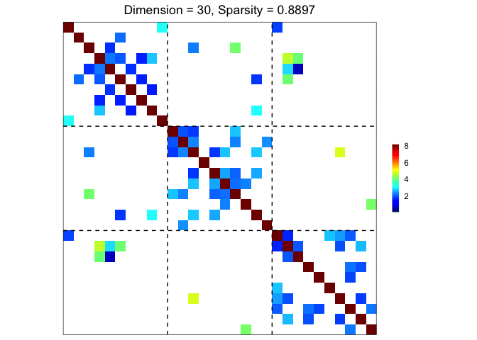

# grasps

## Groupwise Regularized Adaptive Sparse Precision Solution

The goal of **grasps** is to provide a collection of statistical methods
that incorporate both element-wise and group-wise penalties to estimate
a precision matrix, making them user-friendly and useful for researchers
and practitioners.

$$\widehat{\Omega}(\lambda,\alpha,\gamma) = {\arg\min}_{\Omega \succ 0}\left\{ - \log\det(\Omega) + \text{tr}(S\Omega) + P_{\lambda,\alpha,\gamma}(\Omega) \right\},$$

$$P_{\lambda,\alpha,\gamma}(\Omega) = \alpha P_{\lambda,\gamma}^{\text{individual}}(\Omega) + (1 - \alpha)P_{\lambda,\gamma}^{\text{group}}(\Omega),$$

$$P_{\lambda,\gamma}^{\text{individual}}(\Omega) = \sum\limits_{i,j}p_{\lambda,\gamma}\left( |\omega_{ij}| \right),$$

$$P_{\lambda,\gamma}^{\text{group}}(\Omega) = \sum\limits_{g,g^{\prime}}p_{\lambda,\gamma}\left( \|\Omega_{gg^{\prime}}\|_{F} \right).$$

For more details, see the vignette [Penalized Precision Matrix
Estimation in
grasps](https://shiying-xiao.com/grasps/articles/pen_est#sparse-group-estimator).

## Penalties

The package **grasps** provides functions to estimate precision matrices
using the following penalties:

| Penalty                              | Reference                                                                                                                            |
|:-------------------------------------|:-------------------------------------------------------------------------------------------------------------------------------------|
| Lasso (`penalty = "lasso"`)          | Tibshirani ([1996](#ref-tibshirani1996regression)); Friedman et al. ([2008](#ref-friedman2008sparse))                                |
| Adaptive lasso (`penalty = "adapt"`) | Zou ([2006](#ref-zou2006adaptive)); Fan et al. ([2009](#ref-fan2009network))                                                         |
| Atan (`penalty = "atan"`)            | Wang and Zhu ([2016](#ref-wang2016variable))                                                                                         |
| Exp (`penalty = "exp"`)              | Wang et al. ([2018](#ref-wang2018variable))                                                                                          |
| Lq (`penalty = "lq"`)                | Frank and Friedman ([1993](#ref-frank1993statistical)); Fu ([1998](#ref-fu1998penalized)); Fan and Li ([2001](#ref-fan2001variable)) |
| LSP (`penalty = "lsp"`)              | Candès et al. ([2008](#ref-candes2008enhancing))                                                                                     |
| MCP (`penalty = "mcp"`)              | Zhang ([2010](#ref-zhang2010nearly))                                                                                                 |
| SCAD (`penalty = "scad"`)            | Fan and Li ([2001](#ref-fan2001variable)); Fan et al. ([2009](#ref-fan2009network))                                                  |

See the vignette [Penalized Precision Matrix Estimation in
grasps](https://shiying-xiao.com/grasps/articles/pen_est#penalties) for
more details.

## Installation

You can install the development version of **grasps** from
[GitHub](https://github.com/) with:

``` R
# install.packages("devtools")
devtools::install_github("Carol-seven/grasps")
```

## Example

``` r
library(grasps)
#> 
#> Attaching package: 'grasps'
#> The following object is masked from 'package:stats':
#> 
#>     deriv

## reproducibility for everything
set.seed(1234)

## block-structured precision matrix based on SBM
sim <- gen_prec_sbm(d = 100, K = 5,
                    within.prob = 0.5, between.prob = 0.05,
                    weight.dists = list("gamma", "unif"),
                    weight.paras = list(c(shape = 20, scale = 5), c(min = 0, max = 1)),
                    cond.target = 100)

## synthetic data
library(MASS)
X <- MASS::mvrnorm(n = 50, mu = rep(0, 100), Sigma = sim$Sigma)

## solution
res <- grasps(X = X, membership = sim$membership, penalty = "lasso", crit = "BIC")

## visualization
plot(res)
```



## Reference

Candès, Emmanuel J., Michael B. Wakin, and Stephen P. Boyd. 2008.
“Enhancing Sparsity by Reweighted $\ell_{1}$ Minimization.” *Journal of
Fourier Analysis and Applications* 14 (5): 877–905.
<https://doi.org/10.1007/s00041-008-9045-x>.

Fan, Jianqing, Yang Feng, and Yichao Wu. 2009. “Network Exploration via
the Adaptive LASSO and SCAD Penalties.” *The Annals of Applied
Statistics* 3 (2): 521–41. <https://doi.org/10.1214/08-aoas215>.

Fan, Jianqing, and Runze Li. 2001. “Variable Selection via Nonconcave
Penalized Likelihood and Its Oracle Properties.” *Journal of the
American Statistical Association* 96 (456): 1348–60.
<https://doi.org/10.1198/016214501753382273>.

Frank, Lldiko E., and Jerome H. Friedman. 1993. “A Statistical View of
Some Chemometrics Regression Tools.” *Technometrics* 35 (2): 109–35.
<https://doi.org/10.1080/00401706.1993.10485033>.

Friedman, Jerome, Trevor Hastie, and Robert Tibshirani. 2008. “Sparse
Inverse Covariance Estimation with the Graphical Lasso.” *Biostatistics*
9 (3): 432–41. <https://doi.org/10.1093/biostatistics/kxm045>.

Fu, Wenjiang J. 1998. “Penalized Regressions: The Bridge Versus the
Lasso.” *Journal of Computational and Graphical Statistics* 7 (3):
397–416. <https://doi.org/10.1080/10618600.1998.10474784>.

Tibshirani, Robert. 1996. “Regression Shrinkage and Selection via the
Lasso.” *Journal of the Royal Statistical Society: Series B
(Methodological)* 58 (1): 267–88.
<https://doi.org/10.1111/j.2517-6161.1996.tb02080.x>.

Wang, Yanxin, Qibin Fan, and Li Zhu. 2018. “Variable Selection and
Estimation Using a Continuous Approximation to the $L_{0}$ Penalty.”
*Annals of the Institute of Statistical Mathematics* 70 (1): 191–214.
<https://doi.org/10.1007/s10463-016-0588-3>.

Wang, Yanxin, and Li Zhu. 2016. “Variable Selection and Parameter
Estimation with the Atan Regularization Method.” *Journal of Probability
and Statistics* 2016: 6495417. <https://doi.org/10.1155/2016/6495417>.

Zhang, Cun-Hui. 2010. “Nearly Unbiased Variable Selection Under Minimax
Concave Penalty.” *The Annals of Statistics* 38 (2): 894–942.
<https://doi.org/10.1214/09-AOS729>.

Zou, Hui. 2006. “The Adaptive Lasso and Its Oracle Properties.” *Journal
of the American Statistical Association* 101 (476): 1418–29.
<https://doi.org/10.1198/016214506000000735>.
